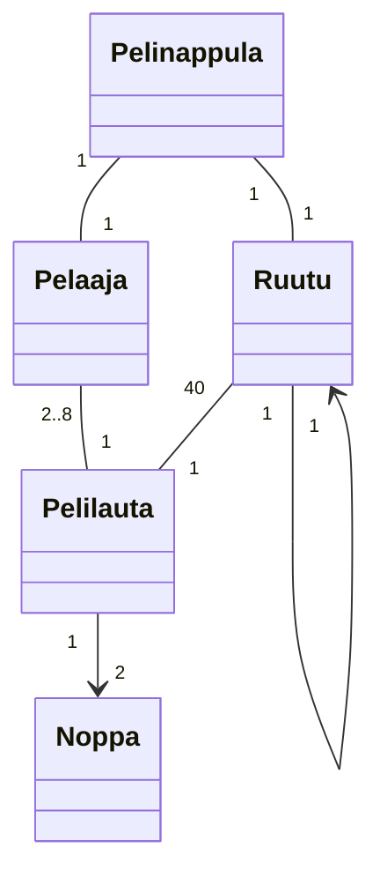
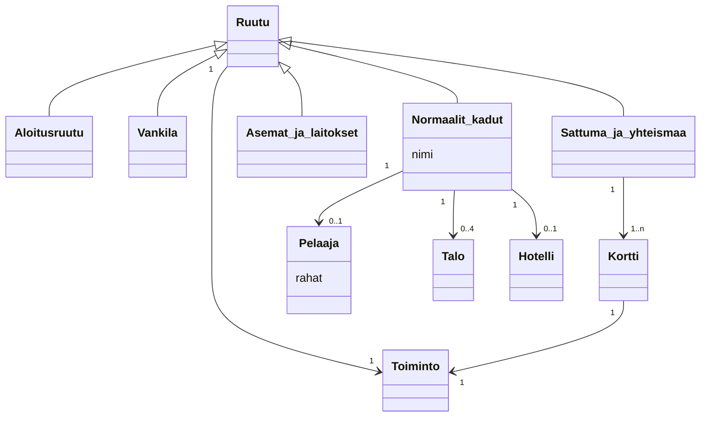

```mermaid
  classDiagram
       Pelaaja "2..8" -- "1" Pelilauta
       Ruutu "40" -- "1" Pelilauta
       Ruutu "1" --> "1" Ruutu
       Pelinappula "1" -- "1" Pelaaja
       Pelinappula "1" -- "1" Ruutu
       Pelilauta "1" --> "2" Noppa
```

```mermaid
  classDiagram
       Ruutu <|-- Aloitusruutu
       Ruutu <|-- Vankila
       Ruutu <|-- Sattuma_ja_yhteismaa
       Ruutu <|-- Asemat_ja_laitokset
       Ruutu <|-- Normaalit_kadut
       Sattuma_ja_yhteismaa "1" --> "1..n" Kortti
       Ruutu "1" --> "1" Toiminto
       Kortti "1" --> "1" Toiminto
       Normaalit_kadut "1" --> "0..1" Pelaaja
       Normaalit_kadut "1" --> "0..4" Talo
       Normaalit_kadut "1" --> "0..1" Hotelli
       class Normaalit_kadut {
        nimi
       }
       class Pelaaja {
        rahat
       }
```