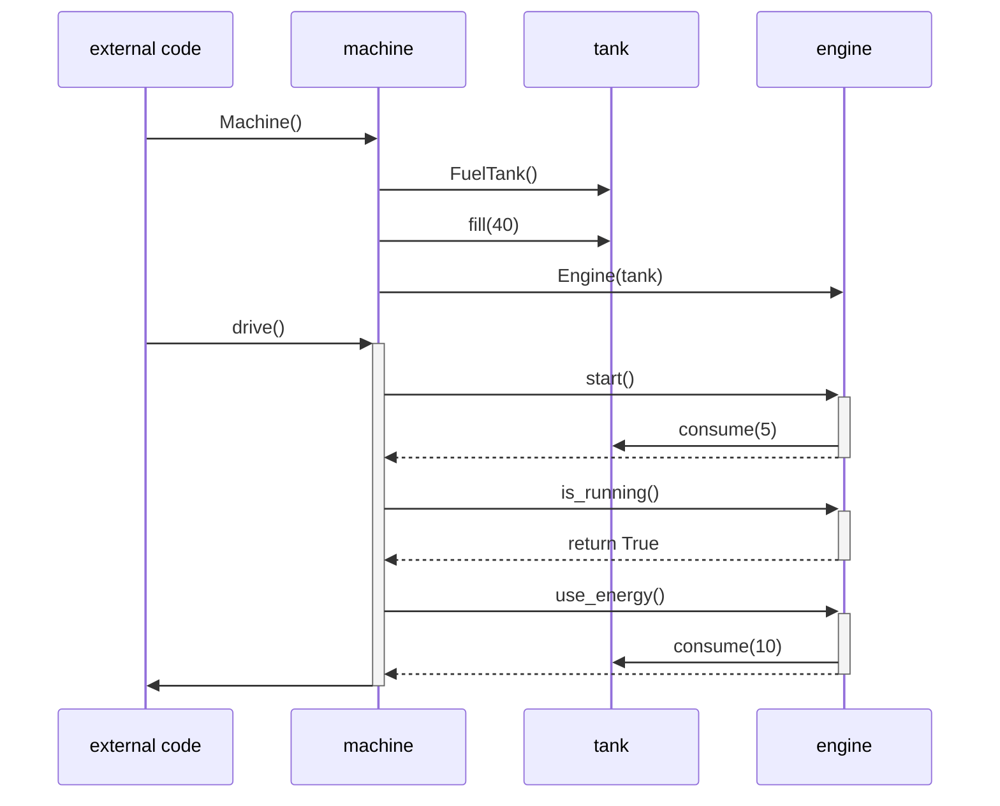

```mermaid
  sequenceDiagram
       participant external code
       external code->>machine: Machine()
       machine->>tank: FuelTank()
       machine->>tank: fill(40)
       machine->>engine: Engine(tank)
       external code->>+machine: drive()
       machine->>+engine: start()
       engine->>tank: consume(5)
       engine-->>-machine:  
       machine->>+engine: is_running()
       engine-->>-machine: return True
       machine->>+engine: use_energy()
       engine->>tank: consume(10)
       engine-->>-machine:  
       machine->>-external code:  
```