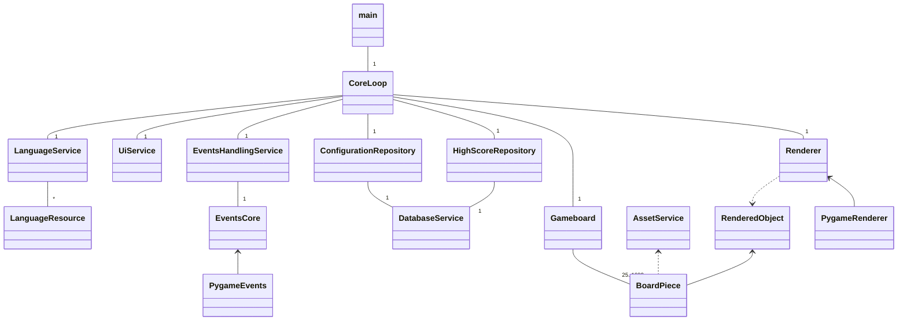
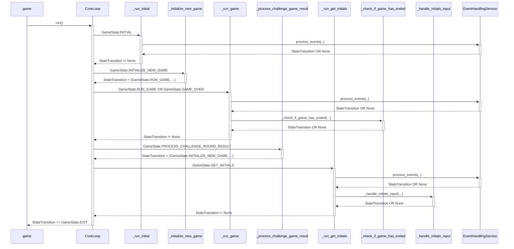

# Sovelluksen arkkitehtuuri

## Yleistason rakenne

Sovelluksen ydinkoodi muodostuu CoreLoop -luokasta, joka ylläpitää sovelluksen tilaa ja suorittaa päätilasiirtymiä (kuvattu jäljempänä) eri toiminnallisten osioiden (alkutila, pelitila, high-score syöte jne.) välillä. CoreLoop:n ajaminen käynnistää sovelluksen toiminnan ja sieltä palaaminen päättää sen.

### Hakemistorakenne

Lähdekoodit on sijoitettu karkeasti jaotellen seuraavien alihakemistojen mukaisesti src/ -juurihakemiston lisäksi joka sisältää sekä käynnistystiedoston game.py että pääkoodin loop.py:

**/src/assets**

Käyttöliittymän kuvatiedostot.

**/src/entities**

Laajemmat luokka-objektit jotka toteuttavat jonkun tietyn toiminnallisen kokonaisuuden, kuten esimerkiksi pelilauta (board.py).

**/src/entities/ui**

Laajemmat luokka-objektit jotka liittyvät käyttöliittymän piirtämiseen, kuten esimerkiksi painonappula (button.py).

**/src/primitives**

Suppeammat luokka-objektit, enumeraatiot ja rajapinta-luokat joita käytetään useammassa paikassa muiden luokkien toimesta, kuten esimerkiksi X,Y -koordinaattia kuvaava Position (position.py).

**/src/pygame**

Pygame -kirjastoa käyttävät konkreettiset luokkatoteutukset (kts. "I/O käsittely" jäljempänä).

**/src/repositories**

Spesifejä datatyyppejä ylläpitävät luokat, kuten esimerkiksi high-score listat (highscore_repository.py).

**/src/services**

Yleiset palveluluokat perustason jaetun toiminnallisuuden toteuttamiseksi, kuten esimerkiksi SQLite tietokantakäsittely (database_service.py).

**/src/tests**

Yksikkötestiluokat.

## Sovelluksen päätilasiirtymät

Sovelluksen runko on toteutettu CoreLoop -luokassa pääluuppina (run() metodi), joka ajaa käyttöliittymää ja peliä tilakoneena. 

Päätason tilavaihdot tapahtuvat GameState -enumeraation mukaisesti eri pelimoodien ja muiden ruutujen välillä, ja osaa päätiloja (GameState.INITIAL, GameState.RUN_GAME, GameState.GAME_OVER) kohden ajetaan tilaspesifistä sisäluuppia. Nämä toteuttavat suurimman osan sovelluksen toiminnallisuudesta. 

Osa päätiloista on vain yksittäisiä siirtymiä muiden tilojen välillä kuten esim. GameState.INITIALIZE_NEW_GAME joka alustaa uuden pelin GameState.RUN_GAME tilaa varten. Paluuarvona jokaisesta päätilan toteuttavasta metodista on tilatransitio-luokka, jonka perusteella pääluuppi ohjaa suorituksen seuraavaan tilaan.

## I/O käsittely

Syötteenkäsittely ja kaiken näkyvän sisällön muodostaminen ruudulle on abstrahoitu Renderer ja EventsCore -rajapintaluokat toteuttaville PygameEvents ja PygameRenderer luokille jota hoitavat I/O:n Pygame -kirjaston avulla. Itse CoreLoop ja muut sen käyttävät luokat käsittelevät vain abstraktilla tasolla syötteitä ja piirto-objekteja, jotka em. luokat kääntävät konkreettisiksi Pygame:n toteuttamiksi toiminnoiksi - ja toisinpäin. Tämä mahdollistaa tarvittaessa Pygame -kirjaston korvaamisen suht vähäisellä vaivalla toisella vastaavalla kirjastolla.

Renderer -luokan toteuttava konkreettinen luokka ottaa jokaisella ruudunpäivityskierroksella [compose() -metodi] listan piirrettäviä objekteja jotka toteuttavat RenderedObject -rajapintaluokan, ja muodostaa niiden perusteella sovellusikkunan sisällön.

Osa RenderedObject -luokasta periytyvistä rakentuvat toisten vastaavien luokkien jo toteuttaman toiminnallisuuden päälle, esim. Button -> TextOverlay -> TextBox (nappula, joka rakentuu TextOverlay luokassa toteutettuun laajempaan tekstinasetteluun joka taas rakentuu TextBoxin tekstin määrittelyn primitiiveihin).

## Peliobjektit

Varsinaisen pelilogiikan sekä siihen liittyvien elementtien (ruudut, muut assetit) muodostamisen toteuttaa Gameboard -luokka, jota CoreLoop luokka ajaa osana tilakoneen pelitilaa.

Gameboard -luokka luo ja pitää sisäisesti yllä listaa BoardPiece -objekteista - jotka muodostavat pelialueen yksittäiset ruudut - lineaarisena taulukkona. Ruutujen määrä riippuu Gameboard -objektin initialisoidusta pelitasosta (leveys x korkeus ruutuina = ruudujen määrä). Ruutuihin kohdistuvat toimenpiteet (avaus ja merkitseminen) tapahtuu Gameboard -objektin kautta käyttämällä ruudun loogisia X ja Y -koordinaatteja, jotka Gameboard muuntaa sisäisen taulukon indeksiksi ja välittää siinä olevalle BoardPiece -objektille halutun toimenpiteen. 

BoardPiece pitää yllä omaa tilatietoa kyseisen ruudun senhetkisestä tilasta (avaamaton, avattu ja tyhjä, avattu ja numero jne.) mutta ei omaa mitään tietoa viereisistä ruuduista. Kokonaistilannetta ylläpitää Gameboard luokka joka toteuttaa loogisesti yhden yksittäisen pelikierroksen alusta joko onnistuneeseen kentän tyhjentämiseen ja lentokoneruutujen tutkalla merkitsemiseen (pelikierroksen voitto), tai lentokoneruudun avaamiseen (pelikierroksen häviäminen). BoardPiece myös toteuttaa RenderedObject -rajapintaluokan ja palauttaa sen hetkisen tilan mukaisen kuva-assetin ruudun piirtoa varten.

## Apuluokat

Päärungon ulkopuolisina apupalveluina ovat:
- ConfigurationRepository -luokka, joka hoitaa DatabaseServicen avulla SQLite kirjaston kautta yleisten konfigurointiasetusten lukemisen ja persistoinnin tietokantaan.
- HighScoreRepository -luokka, joka hoitaa DatabaseServicen avulla pelin high-score tulosten lukemisen ja persistoinnin tietokantaan.
- AssetService -luokka, joka hoitaa kuva-assettien (taustakuva, pelilaudan kuvat) lataamisen levyltä kutsuvalle luokalle.
- EventsHandlingService -luokka, joka prosessoi näppäimistö/hiiri -syötteitä ja tarvittaessa pelin tilan mukaisesti mutatoi pelitilaa tai ohjaa tilakoneen siirtymiä.
- LanguageService -luokka, joka toteuttaa tekstiresurssien hakemisen valitun kielen mukaisesti. LanguageServices luokka lataa käännöstaulukot omina kieliluokkina src/services/languages -hakemistosta ja kieliluokat toteuttavat LanguageResource rajapintaluokan. Uuden kielen lisääminen onnistuu helposti lisäämällä kielikohtaisen kieliluokkatiedoston, ja lisäämällä LanguageService luokkaan ko. kielen nimen IMPORT_LANGUAGES taulukkoon. Huom! Ohjelma olettaa valittavan kielen tunnisteen, jolla se valitaan, olevan kielen kaksi ensimmäistä kirjainta (Finnish = fi jne.)
- UIService -luokka, joka muodostaa CoreLoopin pyynnöstä käyttöliittymäelementtejä sen hetkisen tarpeen mukaan ja jotka kootaan käyttöliittymälle näytettäväksi Renderer toteutuksen kautta.
