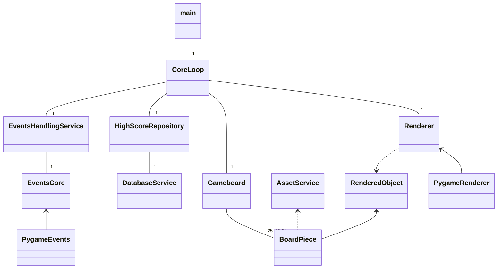

```mermaid
  classDiagram
       main -- "1" CoreLoop
       CoreLoop -- "1" EventsHandlingService
       CoreLoop -- "1" HighScoreRepository
       EventsHandlingService -- "1" EventsCore
       EventsCore <-- PygameEvents
       HighScoreRepository -- "1" DatabaseService
       CoreLoop -- "1" Renderer
       CoreLoop -- "1" Gameboard
       Gameboard -- "25..1682" BoardPiece
       AssetService <.. BoardPiece
       RenderedObject <-- BoardPiece
       Renderer ..> RenderedObject
       Renderer <-- PygameRenderer
```
