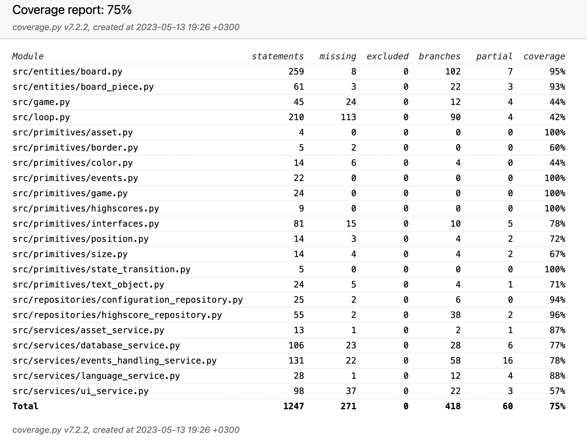

# Testausdokumentti

Pelin testausta on suoritettu sekä pytest/unittestin avulla automaattisesti testaamalla että manuaalisesti testaamalla kokonaisuuten peliä pelaamalla. Etenkin koska kyseessä on nimenomaisesti graafisen käyttöliittymän pelisovellus, visuaalisen oikeellisuuden testaamista ei käytännössä ole automaattisten testien avulla voitu suorittaa.

## Automaattiset testit

Testipääluokkina on käytetty:
- Pelilaudan (`Gameboard` objekti) toteutuksen testausta itsenäisenä kokonaisuutena `board_test.py` -tiedoston `TestGameboard` luokassa. Testikattavuus ko. luokan toimintojen osalta on lähes 100%.
- Pääohjelma-luupin (`CoreLoop` objekti) valittujen ohjelmalogiikan osasten ja toiminnallisuuksien testausta `gameloop_test.py`-tiedoston `TestCoreLoop` luokassa. Koska CoreLoop toteuttaa myös UI:hin liittyviä toimintoja osana ohjelman kulkua, osaa näistä toiminnoista ei mielekkäästi ollut testattavissa yksikkötesteillä joten kyseisen luokan testikattavuus on koodirivien kannalta alle 50%.
- Asetusten ylläpidon ja tietokannan (`ConfigurationRepository` objekti sekä `DatabaseService` objekti) toteutuksen testausta `configuration_test.py` -tiedoston `TestGameConfiguration` luokassa. Näiden osalta testikattavuus on korkealla tasolla
- High-score listojen ylläpidon ja tietokannan (`HighScoreRepository` objekti sekä `DatabaseService` objekti) toteutuksen testausta `highscores_test.py` -tiedoston `TestHighscores` luokassa. Näiden osalta testikattavuus on korkealla tasolla.
- Tapahtumankäsittelyn (`EventsHandlingService` objekti sekä `InputBuffer` objekti) toteutuksen testausta `events_test.py` -tiedoston `TestEventsHandling` luokassa. Kuten CoreLoop, tapahtumankäsittely on osittain hyvinkin paljon sidoksissa UI:hin ja I/O:hon, josta johtuen testikattavuus näiden osalta ei ole kovin korkea - huomattavaa on että tapahtumankäsittelyn koodipolkuja tulee epäsuorasti kutsuttua myös muiden testien kautta.
- Kieliversioiden (`LanguageService` objekti) toteutuksen testausta `language_test.py` -tiedoston `TestLanguageService` luokassa. Kieliversioiden teknisten toteutuksen yksinkertaisuudesta johtuen testien määrä ei ole kovinkaan iso ja testaa lähinnä että palautuva testiteksti on oikean kielen mukainen.

### Testauskattavuus

Automaattisten testien haarautumakattavuus on 75% tasolla.

## Manuaalinen testaus

Sovellus on kehitetty ja testattu macOS käyttöjärjestelmän 12.6.5 (Monterey) versiossa, Applen M2 -suoritinalustalla. Tämän lisäksi testausta on suoritettu Cubbli Linux -käyttöjärjestelmäympäristössä alustaversioiden eroavaisuuksien havaitsemiseksi.

Testauksessa pelin eri käytettävissä olevat toiminnot on käyty läpi sekä UI tasolla että tuettujen komentoriviparametrien kautta. Nämä toiminnallisuudet ovat kuvattuna pelin [käyttöohjeessa](./kayttoohje.md).

## Tunnetut ongelmat

Pelisovelluksessa ei ole tällä hetkellä tunnettuja toimivuusongelmia tai puutteita toiminnoissa.
