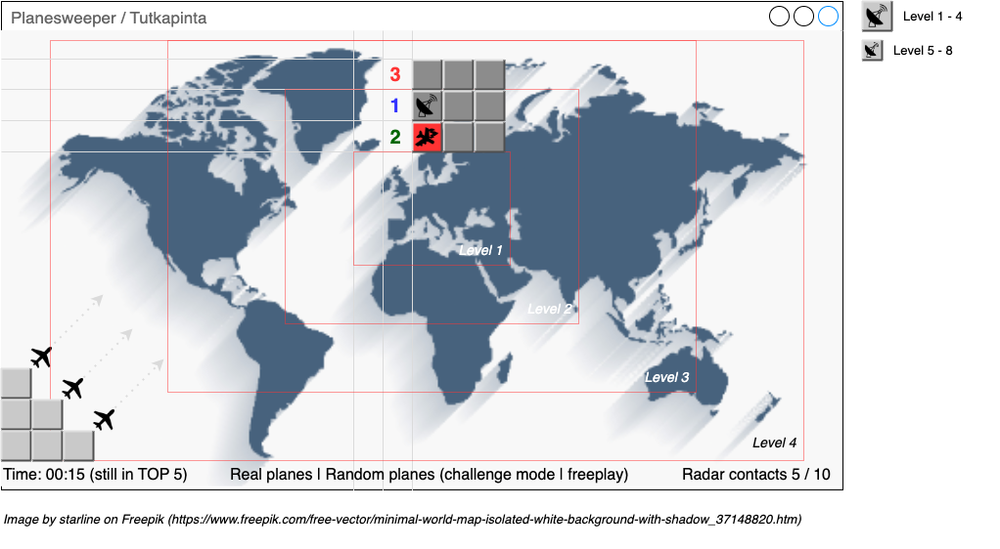

# Vaatimusmäärittely

## Sovelluksen kuvaus

Toteutettava sovellus on tietokonepeli, joka on muunneltu toteutus klassisesta Miinaharava -pelistä. Toteutettavassa pelissä miinojen sijasta etsitään tutkakontakteja lentokoneista ja pelialueen (ruutujen) taustana toimii maailmankartta. 

Pelin perustoimintalogiikkana on "avata" yksittäisiä ruutuja (vasen hiiren näppäin) ja päätellä alla olevien numeroiden kautta missä vielä avaamattomissa ruuduissa ovat lentokoneet, jotka tulee merkitä tutkakontaktimerkinnällä (oikea hiiren näppäin) kunnes kaikki valittuun vaikeustasoon kuuluvat koneet on tunnistettu ja kaikki muut ruudut on avattu. Mikäli ruudun avaa ja sieltä paljastuukin lentokone, on pelikierros päättynyt epäonnistumiseen.

## Käyttäjät

Koska sovellus on peli, erityisiä käyttäjärooleja ei sovelluksessa ole vaan ainoa käyttäjä on pelin interaktiivinen pelaaja.

## Perustoiminnallisuudet

Pelistä toteutetaan ensivaiheessa versio jossa on seuraavat toiminnallisuudet:

- Vaihtuvakokoinen pelialue / vaikeustaso - **tehty**
  - Ruudukon koko sekä koneiden määrä - **tehty**
- Kaksi pelitilaa: 
  - Satunnaispeli yksittäiseen pikapeliin vapaasti valittavalla vaikeustasolla - **tehty**
  - Haastemoodi, jossa edetään vaikeustasolta seuraavalle **tehty**
    - Haastemoodissa kentän selvittämisen epäonnistuminen palauttaa aiemmalle tasolle ja läpäisy seuraavalle tasolle **tehty**
- Paikalliseen tietokantaan tallennettava high-score lista **tehty**
  - Pohjautuu vaikeustasoon ja pelialueen selvityksen kokonaisaikaan **tehty**
- Englanninkieliset tekstit **tehty**

## UI konseptikuva

## Lisätoiminnallisuudet

Lisäksi toteutetaan, mikäli jäljellä oleva toteutusaikataulu mahdollistaa:

- Reaaliaika-API:sta haettavat oikeiden koneiden sijainnit (esim. [Aviationstack](https://aviationstack.com/))
  - Oma pelitilansa satunnaisesti arvottujen koneiden sijasta, haettujen konesijaintien joukosta arvotaan vaikeustasoon kuuluvan totaalikonemäärän mukainen määrä koneita ja jotka sijoitetaan pelialueen taustalla olevan maailmankartan mukaan oikeisiin geopositioihin
  - Tallennetaan välimuistiin paikalliseen tietokantaan jotta API:a ei tarvitse joka kerta uudestaan kysyä, vaan esim. tunnin välein päivitetään
- Jatkokehitysmahdollisuutena käyttää lisäksi API-datan osalta koneen sijainnin lisäksi suuntavektoria ja nopeutta laskeakseen hakujen välillä koneen uusia positioita
- Mahdollisuus valita teksteiksi suomen kieli **tehty**
  - Mahdollistaa muidenkin kielien lisäämisen myöhemmin jatkokehityksenä **tehty**
- Pelialueen aloituksen animaatiot